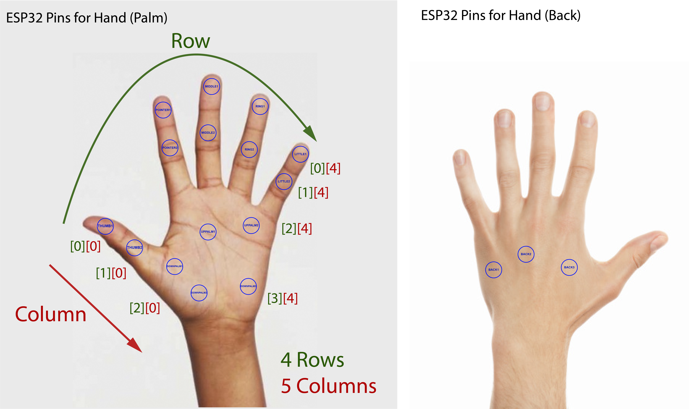

# Haptic Glove API
---
## Base URL

- Floating IP Address (related to local network): `10.100.xx.xx`

## Paths & Methods

- `/api/uptime`: Get system/glove server uptime.
  - `GET`
<br/>

- `/api/events`: Get sent/unfinished vibration events.
  - `GET`
<br/>

- `/api/events` + Json format parameters (see examples): Create a vibration event/pattern.
  - `POST`

## Parameters

- `mode`: Which haptic pattern to run.
  - Type: `int`
    - `0`: Real-time trigger (default)
    - `1`: Heartbeat around whole hand/all motors
    - `2`: Random raining/iteration around whole hand/all motors
    - `3`: Spreading vibration on fingertips
    - `4`: Spreading vibration on palmar area
    - `5`: ON/OFF vibration on single point/motor at random intensity and duration
<br/>

- `gpio` ([table](https://docs.google.com/spreadsheets/d/1xMyx5uSyoMSGjIM0tracWTi3uiCalNmF4IYBjM9n4XA/edit?usp=sharing)): Which pin(s)/motor(s) to trigger.
  - Type: `int`
  
  ([original size](https://github.com/cv47522/nodejs-express-rest-api-vibration/blob/master/docs/glove_motor_position.png))
<br/>

- `intensity`: How strong is the vibration.
  - Type: `int`
    - `0` ~ `60`: OFF mode
    - `250`: max. ON mode
<br/>

- `duration`: How fast/many **milliseconds** will this haptic pattern run.
  - Type: `int`
<br/>

- `round`: How many rounds will this haptic pattern run.
  - Type: `int`
<br/>

- `time`: Works as a placeholder (not functioning).
  - Type: `long`
<br/>

---
## Examples

- Check if the glove server is turned on by getting its uptime information:
  - Request:
    - [HTTPie](https://httpie.io/) command:
    ```bash
    # shell
    http GET http://10.100.xx.xx/api/uptime
    ```
    - Browsers: http://10.100.xx.xx/api/uptime
  - Response (Json):
  ```json
    {  
        "uptime": "753"
    }
    ```
<br/>

- Create a call to turn ON/OFF a motor at pin number 27 with a specific intensity (e.g. level 150):
  - Request:
    - [HTTPie](https://httpie.io/) command:
    ```bash
    # shell
    # turn ON
    http POST http://10.100.xx.xx/api/events time=999999 mode=0 gpio=27 intensity=150

    # turn OFF
    http POST http://10.100.xx.xx/api/events time=999999 mode=0 gpio=27 intensity=0
    ```
    - [Postman](https://www.postman.com/): `POST`
    ```json
    {
        "time": "999999",
        "mode": "0",
        "gpio": "27",
        "intensity": "150" // turn ON
    }
    ```

  - Response (Json):
   ```json
    { 
        "id": "0",
        "time": "999999",
        "mode": "0",
        "gpio": "27",
        "intensity": "150",
        "duration": "0",
        "round": "0"
    }
    ```
<br/>

- Check if there is any sent/unfinished vibration event:
  - Request:
    - [HTTPie](https://httpie.io/) command:
    ```bash
    # shell
    http GET http://10.100.xx.xx/api/events
    ```
    - Browsers: http://10.100.xx.xx/api/events
  - Response (Json):
  ```json
    {
        "id": "0",
        "time": "999999",
        "mode": "0",
        "gpio": "27",
        "intensity": "150",
        "duration": "0",
        "round": "0"
    }
    ```
<br/>

- Create a call to run a preset haptic pattern with specific parameters:
  - Request:
    - [HTTPie](https://httpie.io/) command:
    ```bash
    # shell
    # mode 1: run the heartbeat pattern through whole hand/all motors at the 120 ms duration/period for 10 rounds
    http POST http://10.100.xx.xx/api/events time=999999 mode=1 intensity=150 duration=120 round=10
    ```
    - [Postman](https://www.postman.com/): `POST`
    ```json
    {
        "time": "999999",
        "mode": "1", // Heartbeat
        "intensity": "150",
        "duration": "120",
        "round": "10"
    }
    ```

  - Response (Json):
   ```json
    {
        "id": "1",
        "time": "999999",
        "mode": "1",
        "gpio": "27", // from previous request call
        "intensity": "150",
        "duration": "120",
        "round": "10"
    }
    ```
<br/>